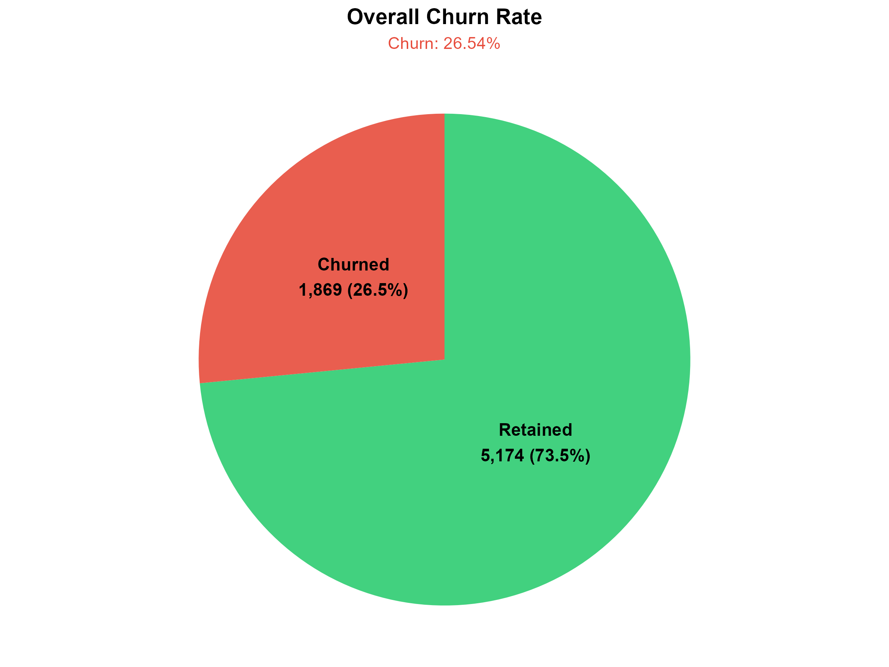
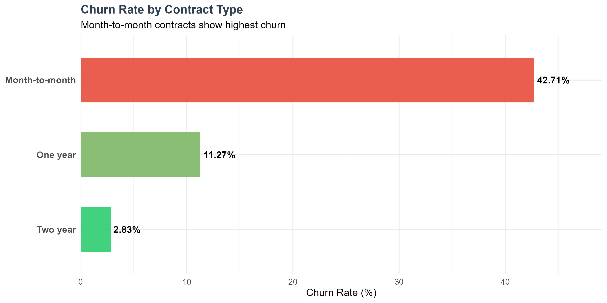
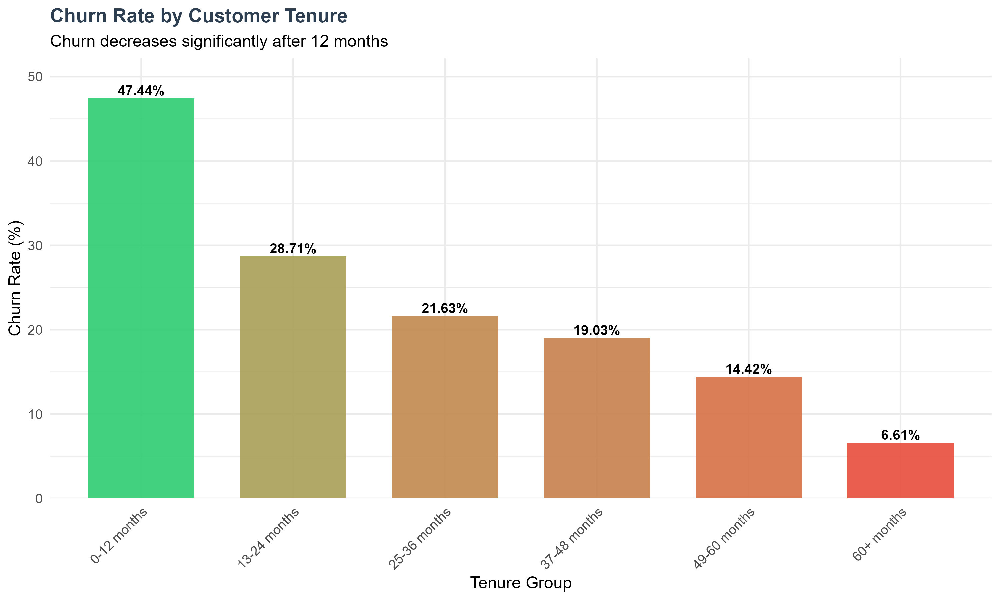
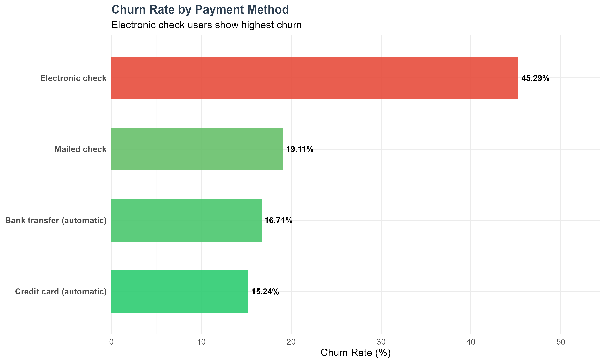
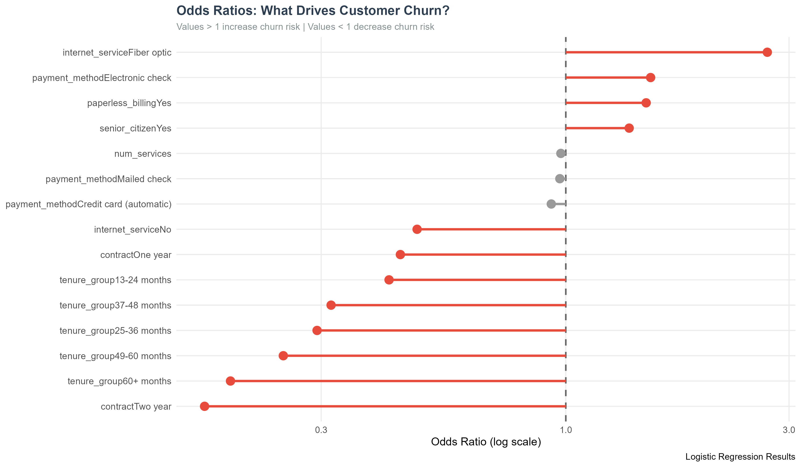
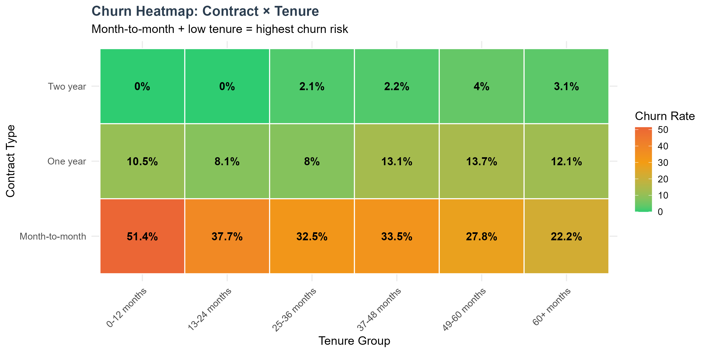

# FUTURE_DS_02

## Customer Retention & Churn Analysis

**Future Interns — Data Science & Analytics Task 2**

---

## 📊 Project Overview

This project analyzes **7,043 customers** from a telecommunications company to identify churn patterns, key risk factors, and retention strategies. Using chi-square tests and logistic regression, the analysis identifies the strongest predictors of customer churn and provides evidence-based business recommendations.

---

## 🎯 Business Questions Answered

1. ✅ Why are customers leaving?
2. ✅ Which segments are most at risk?
3. ✅ How long do customers typically stay?
4. ✅ What services correlate with retention?
5. ✅ What actions can reduce churn?

---

## 📈 Key Performance Indicators

| Metric | Value |
|--------|-------|
| **Total Customers** | **7,043** |
| **Churn Rate** | **26.54%** |
| Churned Customers | 1,869 |
| Retained Customers | 5,174 |
| **Monthly Revenue at Risk** | **$121,040** |
| **Yearly Revenue at Risk** | **$1,452,475** |

---

## 🔍 Key Findings

### The Churn Profile
The highest-risk customer is on a **month-to-month contract**, paying by **electronic check**, using **Fiber Optic internet**, and in their **first year** of service.

### Critical Risk Factors
- 🔴 **Month-to-Month Contract:** 42.71% churn (vs 2.83% for two-year)
- 🔴 **Electronic Check Payment:** 45.29% churn (vs 15.24% for credit card auto-pay)
- 🔴 **Fiber Optic Internet:** 41.89% churn (vs 7.40% for no internet)
- 🔴 **First-Year Customers:** 47.44% churn (vs 6.61% for 60+ months)
- 🔴 **Senior Citizens:** 41.68% churn (vs 23.61% for non-seniors)

### Protection Factors
- 🟢 **Two-Year Contract:** 83% lower churn risk (Odds Ratio: 0.17×)
- 🟢 **60+ Months Tenure:** 81% lower churn risk (Odds Ratio: 0.19×)
- 🟢 **7+ Services:** Only 5.79% churn rate

---

## 🔬 Statistical Evidence

| Analysis | Key Result |
|----------|------------|
| **Chi-Square Tests** | 17 of 19 variables significant (p < 0.05) |
| **Logistic Regression** | 79.81% accuracy, 90.34% specificity |
| **Top Risk Factor** | Fiber Optic Internet: 2.70× odds ratio |
| **Top Protection** | Two-Year Contract: 0.17× odds ratio |
| **Pseudo R²** | 0.2689 |

---

## 💼 Business Recommendations

### Immediate Actions (0-3 months)
1. **Launch contract conversion campaign** — Incentivize month-to-month customers to switch to annual contracts
2. **Address Fiber Optic churn** — Investigate service quality; 41.9% churn suggests product issues
3. **Promote automatic payments** — Electronic check users churn at 3× the rate of auto-pay users

### Strategic Initiatives (3-12 months)
4. **First-year retention program** — 47.4% of new customers leave within 12 months
5. **Senior citizen support** — 41.7% churn requires specialized retention
6. **Service bundling strategy** — 7+ services = only 5.79% churn

### Estimated Impact
Reducing churn by **5 percentage points** (26.5% → 21.5%) would retain **350 customers** and save **$272,000 in annual revenue**.

---

## 🛠️ Tools & Techniques

| Technique | Purpose |
|-----------|---------|
| **R / tidyverse** | Data cleaning, transformation, analysis |
| **Chi-Square Tests** | Identify statistically significant churn factors |
| **Cramer's V** | Measure effect size of predictors |
| **Logistic Regression** | Quantify churn risk with odds ratios |
| **Confusion Matrix** | Evaluate model performance |
| **ggplot2** | Professional data visualizations |
| **LaTeX / Overleaf** | Professional report generation |
| **Git / GitHub** | Version control and portfolio |

---

---

## 📸 Visualizations

### Churn Overview

### Key Risk Factors

### Statistical Analysis

---

## 📝 Methodology

1. **Data Cleaning** — Handle missing values, create derived features (tenure groups, service counts)
2. **Descriptive Analysis** — Churn rates by contract, tenure, internet, payment, demographics
3. **Chi-Square Tests** — Identify statistically significant churn predictors
4. **Cramer's V** — Measure effect size of each predictor
5. **Logistic Regression** — Quantify churn risk with odds ratios
6. **Model Evaluation** — Confusion matrix, accuracy, sensitivity, specificity
7. **Business Recommendations** — Evidence-based retention strategies

---

## 🎓 Skills Demonstrated

- Customer churn and retention analysis
- Statistical hypothesis testing (Chi-Square)
- Effect size measurement (Cramer's V)
- Predictive modeling (Logistic Regression)
- Model evaluation and interpretation
- Business-focused insight generation
- Professional data visualization
- Reproducible research practices

---

## 📞 Connect

**Author:** Thembinkosi Phama  
**Repository:** [FUTURE_DS_02](https://github.com/TS-PHAMA/FUTURE_DS_02)  
**Internship:** Future Interns — Data Science & Analytics Track

---

*© 2026 — Future Interns Data Science & Analytics Task 2*
